# **Documentation pour l'installation de la base de données**

## Installation de Laragon

### Il faut tout d'abord télecharger Laragon sur [Laragon](https://laragon.org/download/):

- Puis lancer le fichier téléchargé:

- Pour l'installation suivre les étapes suivantes:

1. 
2. 
3. 

----------------------------------------------------------------
### Il faut ensuite configurer Laragon

- Une fois Laragon lancé, une fenêtre apparaît:

- Il faut alors faire un clic droit sur la fenêtre et lancé Apache de cette manière:

- Ensuite il faut refaire un autre clic droit sur la fenêtre et installer Postgresql en cliquant sur postgresql-14:

- Une fois l'installation de postgresql réalisé il va falloir indiqué à votre ordinateur son chemin d'accés. Si vous avez suivi l'installation, ce chemin est: **C:\laragon\bin\postgresql\postgresql-14.5-1\bin**

    - Il vous faut aller sur vos variables d'environnement. Utilisez la barre de recherche de votre ordinateur pour les chercher: 

    

    - Ensuite cliquer sur "variables d'environnement" sur la fenêtre qui est apparu

    

    - Dans la nouvelle fenêtre cliquer sur la ligne Path en haut de la fenêtre, puis sur modifier

    

    -Enfin dans la dernière fenêtre apparu cliquer en haut à droite sur nouveau et ajouter dans la ligne qui apparait le chemin précédemment obtenu de postgresql

    

    -Finalement fermer les 3 fenêtres en cliquant sur ok sur chacune d'elle

----------------------------------------------------------------
### Configuration de la base de données

- Pour commencer démarrer le serveur Posgresql à partir de la fenêtre de Laragon, en cliquant sur Démarrez.

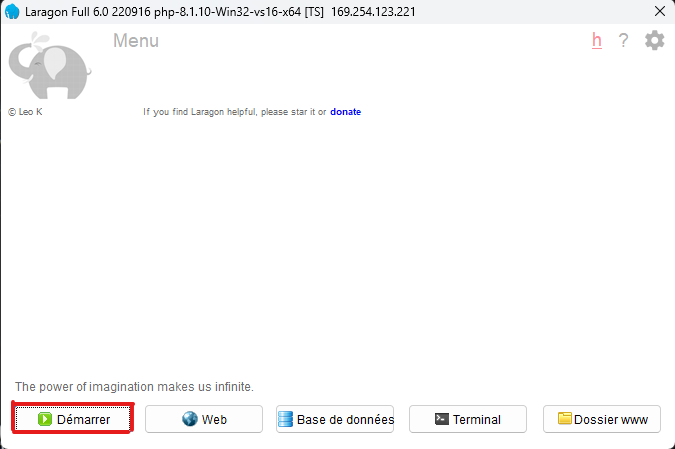

- Votre fenêtre Laragon doit alors ressembler à ceci

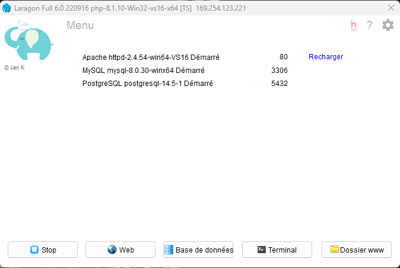

- Ouvrez ensuite VScode et le dossier du projet 

- Ouvrez alors votre terminal à partir de VScode

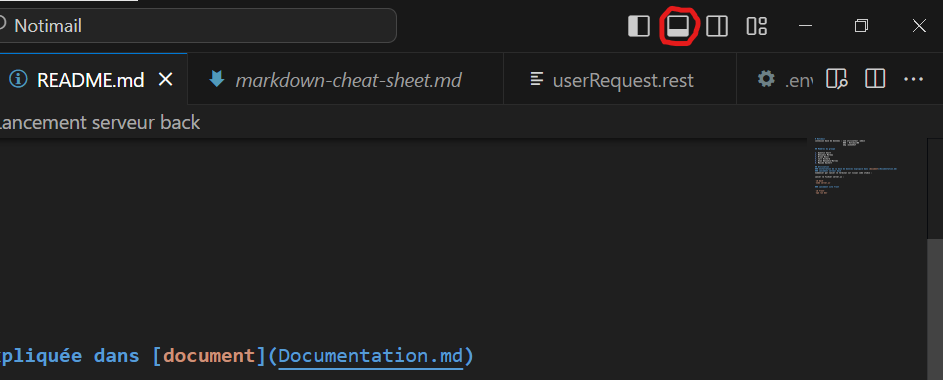

- apparaîtra ainsi votre terminal dans lequel vous trouverez une ligne indiquant le chemin du dossier de votre projet

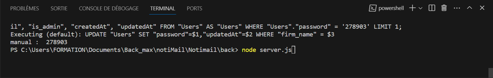

- Vous devrez alors à la suite de cette ligne écrire la commande pour accéder au dossier serveur du projet nommé "back" dans ce cas. Pour cela, il vous faudra écrire: **chemin-du-projet\Notimail>cd back**

- Une fois cette commande réalisé une nouvelle ligne apparaîtra à laquelle vous devrait ajouter: **chemin-du-projet\Notimail\back>psql**. Afin d'accéder à la base de données postgresql

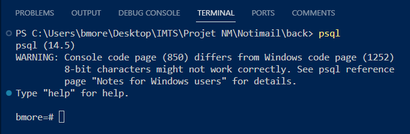

- A partir de ce point vous pouvez créer votre base de données, en suivant l'exemple suivant, avec le nom que vous souhaitez à la place, sur cette exemple, de nom_de_la_base. Et vous obtiendrez ce résultat:

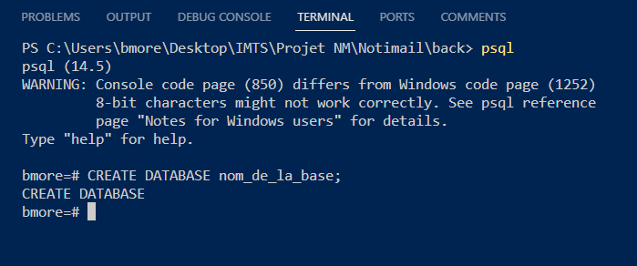

- Vous pouvez ensuite quitter psql en tappant **ctrl-c**

- Retournez alors sur Laragon et cliquez sur Base de données:

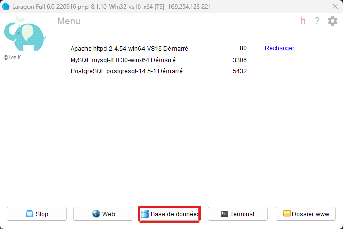

- Une autre fenêtre apparaît alors:

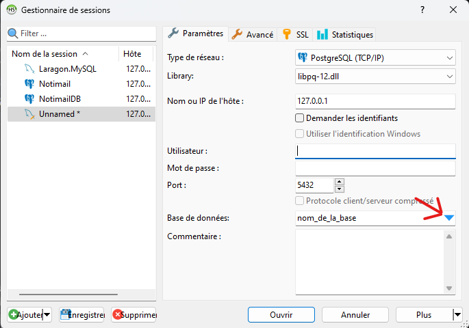

- Sur cette fenêtre vous devrait choisir le nom que vous souhaitez pour votre base de données à la place de "Unnmamed". 
    - Utilisez ensuite la configuration comme sur cet exemple, vous devrez seulement choisir un nom d'Utilisateur et un Mot de Passe qui vous servirons pour accéder à la base de données. 
    - Et finalement, il vous faudra sur la peite flêche bleu en bas à droite et sélectionner le nom que vous avez crée avec psql.

- Enfin cliquer sur Ouvrir et vous arriverez sur cette fenêtre:

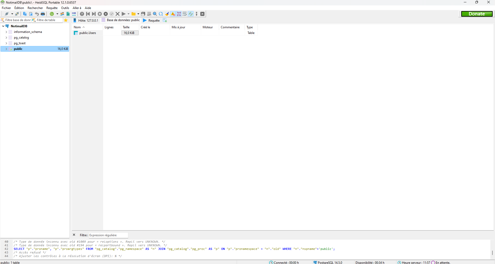

--------------------------------------------------------
### Création de la Base de données

- Revenez ensuite sur VScode, et ouvrez le fichier .env situé dans le dossier back:

- Dans ce fichier vous devrez ajoutez les élements de configuration que vous avez sélectionner précedemment sur Laragon:

    - le nom de la base de données que vous avez choisi sur psql à la suite de DB_NAME
    - Le nom d'Utilisateur à la suite de DB_User
    - Le mot de passe à la suite de DB_PASSWORD
    - Conservez le reste des données 

- Retournez sur votre Terminal et tapez la ligne de commande suivante

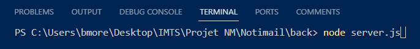

- Une fois cette étape réalisé retourner sur votre base de données. Vous trouverez dans le dossier "public" la table "Users" qui a été créée.

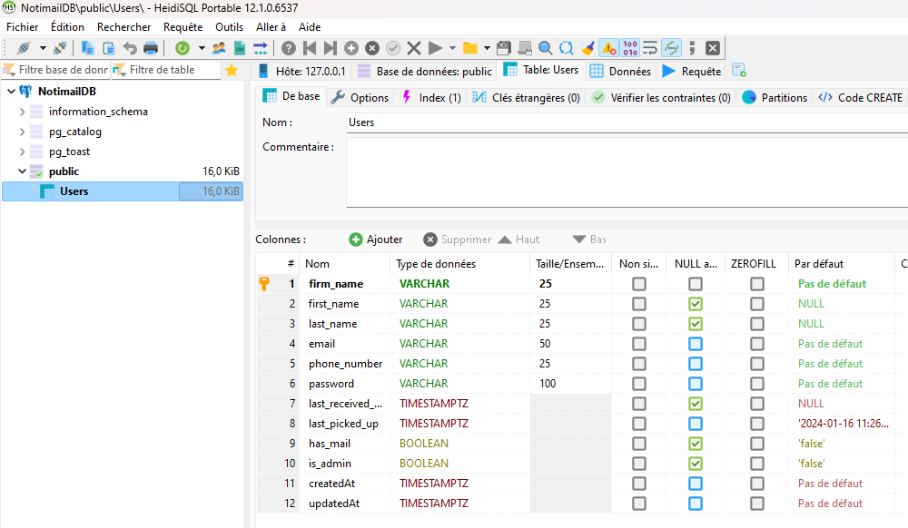

----------------------------------------------------------------
# Votre base de données a été créée

