# **Documentation pour l'installation de la base de données**

## Installation de Laragon

### Il faut tout d'abord télecharger Laragon sur: [Laragon](https://laragon.org/download/):

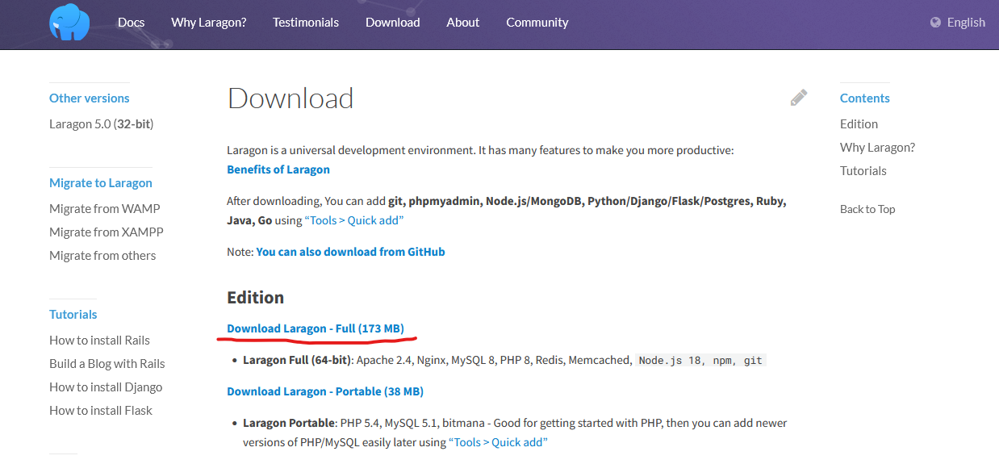

- Puis lancer le fichier téléchargé:

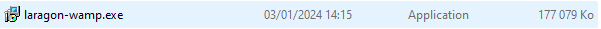

- Pour l'installation suivre les étapes suivantes:

1. 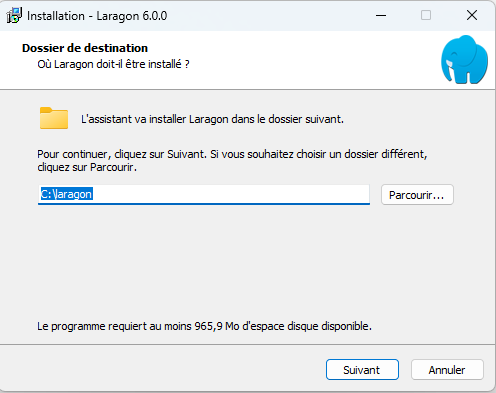
2. 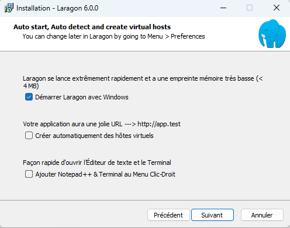
3. 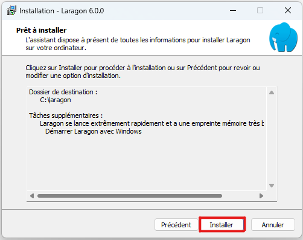

### Il faut ensuite configurer Laragon

- Une fois Laragon lancé, une fenêtre apparaît:

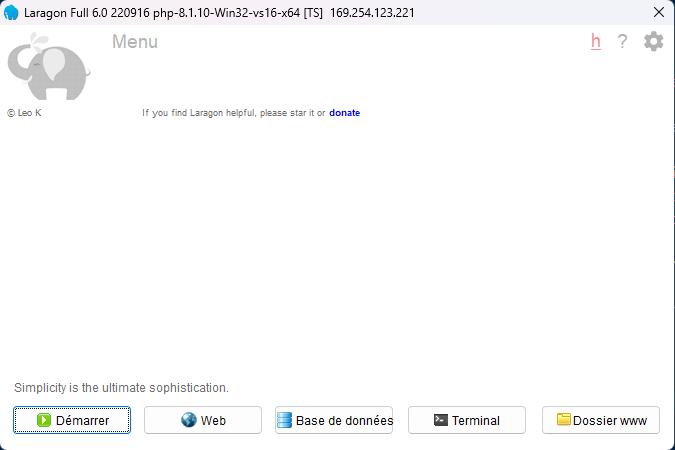

- Il faut alors faire un clic droit sur la fenêtre et lancé Apache de cette manière:

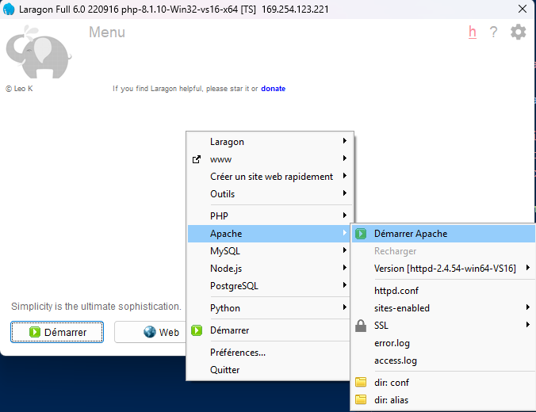

- Ensuite il faut refaire un autre clic droit sur la fenêtre et installer Postgresql en cliquant sur postgresql-14:

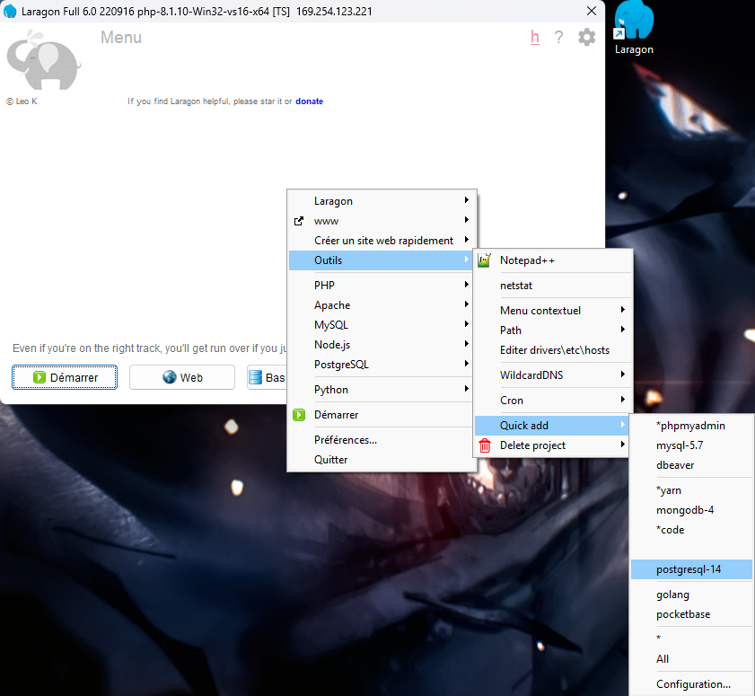

- Une fois l'installation de postgresql réalisé il va falloir indiqué à votre ordinateur son chemin d'accés. Si vous avez suivi l'installation, ce chemin est: **C:\laragon\bin\postgresql\postgresql-14.5-1\bin**

    - Il vous faut aller sur vos variables d'environnement. Utilisez la barre de recherche de votre ordinateur pour les chercher: 

    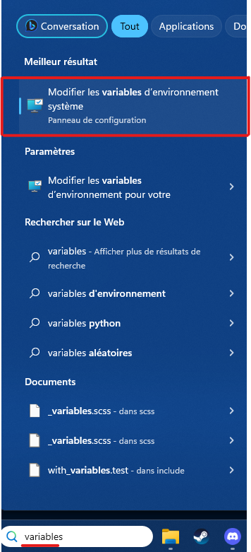

    - Ensuite cliquer sur "variables d'environnement" sur la fenêtre qui est apparu

    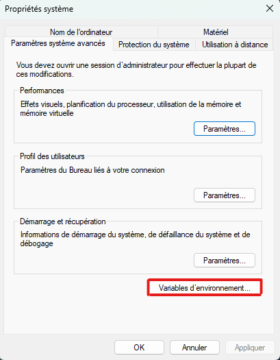

    - Dans la nouvelle fenêtre cliquer sur la ligne Path en haut de la fenêtre, puis sur modifier

    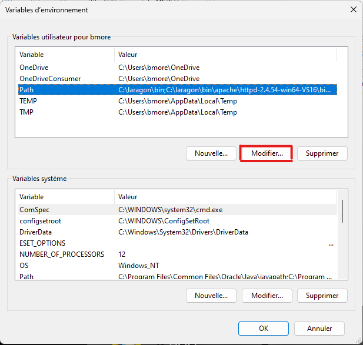

    -Enfin dans la dernière fenêtre apparu cliquer en haut à droite sur nouveau et ajouter dans la ligne qui apparait le chemin précédemment obtenu de postgresql

    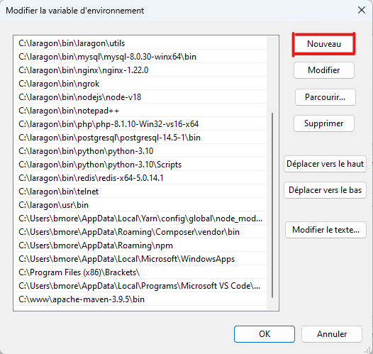

    -Finalement fermer les 3 fenêtres en cliquant sur ok sur chacune d'elle

